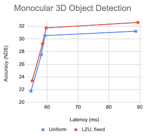

# Learning to Zoom and Unzoom

Official repository for the CVPR 2023 paper _Learning to Zoom and Unzoom_ [[paper]](https://arxiv.org/abs/2303.15390) [[website]](https://tchittesh.github.io/lzu/).

<p float="left">
  
  
</p>

In a nutshell, LZU is a highly flexible method to apply spatial attention to neural nets.
The extremely simple source code ([zoom](./lzu/fixed_grid.py) and [unzoom](./lzu/invert_grid.py)) can be applied to any model that uses spatial processing (e.g. convolutions).

## Setup (Code + Data + Models)

<details>
  <summary>1) Set up the coding environment</summary>

  <br></br>
  First, clone the repository (including the mmdet3d submodule):
  ```bash
  git clone https://github.com/tchittesh/lzu.git --recursive && cd lzu
  ```

  Then, you'll need to install the MMDetection3D (v1.0.0rc6) submodule and the lzu package.
  To do this, you can either:
  - replicate our exact setup by installing [miniconda](https://docs.conda.io/en/latest/miniconda.html) and running 
  ```
  conda env create -f environment.yml
  ```
  - OR install it from scratch according to [getting_started.md](https://github.com/open-mmlab/mmdetection3d/blob/47285b3f1e9dba358e98fcd12e523cfd0769c876/docs/en/getting_started.md) and then install our lzu package with
  ```bash
  pip install -e .
  ```

  The first option should be more reliable, but not as flexible if you want to run specific versions of Python/PyTorch/MMCV.
</details>

<details>
  <summary>2) Download the dataset</summary>
  
  <br></br>
  You'll need to set up the [nuScenes](https://www.nuscenes.org/nuscenes#download) dataset according to [data_preparation.md](https://github.com/open-mmlab/mmdetection3d/blob/47285b3f1e9dba358e98fcd12e523cfd0769c876/docs/en/data_preparation.md). Your final `data` folder should look like this:
  ```
   data/nuscenes/
   ├── maps/
   ├── samples/
   ├── sweeps/
   ├── v1.0-trainval/
   ├── nuscenes_infos_train_mono3d.coco.json
   ├── nuscenes_infos_train.pkl
   ├── nuscenes_infos_val_mono3d.coco.json
   └── nuscenes_infos_val.pkl
  ```
</details>

<details>
  <summary>3) [Optional] Download our pretrained checkpoints</summary>

  <br></br>
  Download our pretrained checkpoints from [Google Drive](https://drive.google.com/file/d/1nofuqZ7YSKblIDAltbxp1pFOiQtUzp8B/view?usp=sharing) and place them in this directory, using symbolic links if necessary.
</details>

## Scripts

This should be super easy! Simply run

```
sh run.sh [experiment_name]
```

for any valid experiment name in the `configs/` directory.
Examples include `fcos3d_0.50`, which is the uniform downsampling baseline at 0.50x scale, and `lzu_fcos3d_0.75`, which is LZU at 0.75x scale.

This script will first run inference using the pretrained checkpoint, then train the model from scratch, and finally run inference using the trained model.

## Results

Our pretrained models (from the paper) achieve the following NDS scores.

| Scale | Baseline Experiment | NDS         | LZU Experiment     | NDS         |
| ----- | ------------------- | ----------- | ------------------ | ----------- |
| 0.25x | fcos3d_0.25         | 0.2177      | lzu_fcos3d_0.25    | 0.2341      |
| 0.50x | fcos3d_0.50         | 0.2752      | lzu_fcos3d_0.50    | 0.2926      |
| 0.75x | fcos3d_0.75         | 0.3053      | lzu_fcos3d_0.75    | 0.3175      |
| 1.00x | fcos3d_1.00         | 0.3122      | lzu_fcos3d_1.00    | 0.3258      |

As can be seen, LZU achieves a superior accuracy-latency tradeoff compared to uniform downsampling. For more details, please refer to our [paper](https://arxiv.org/abs/2303.15390).



## Citation

If you find our code useful, please consider citing us!
```
@misc{thavamani2023learning,
      title={Learning to Zoom and Unzoom}, 
      author={Chittesh Thavamani and Mengtian Li and Francesco Ferroni and Deva Ramanan},
      year={2023},
      eprint={2303.15390},
      archivePrefix={arXiv},
      primaryClass={cs.CV}
}
```
